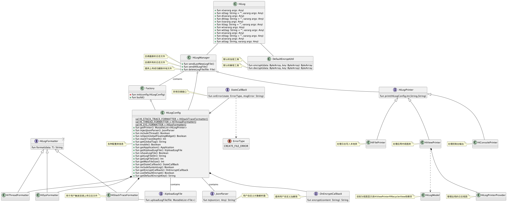
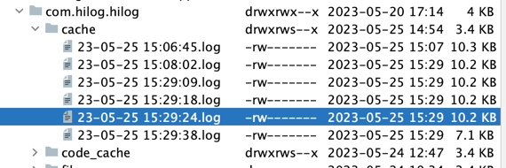
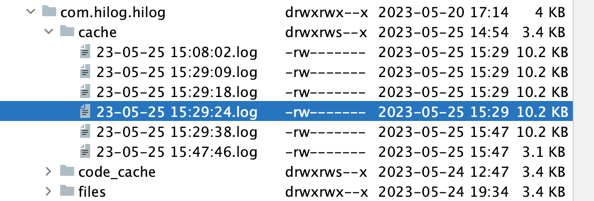
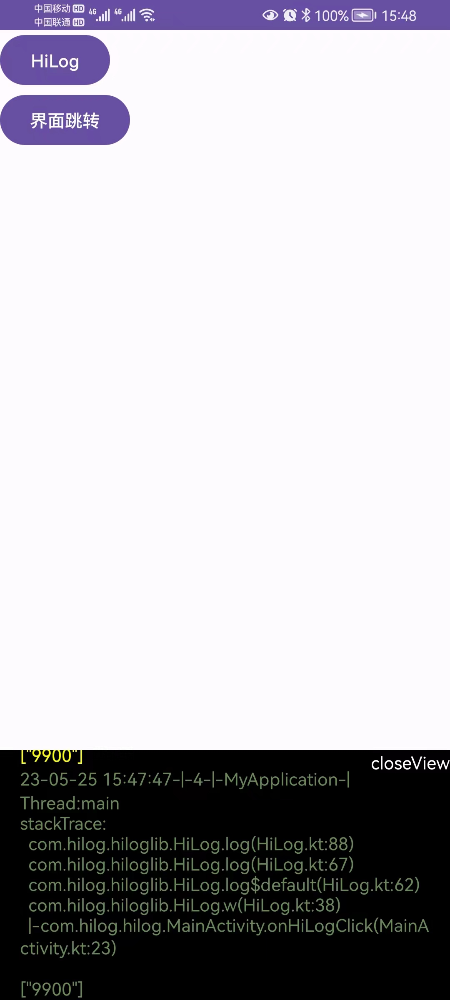

# HiLog

该项目为日志android端日志管理系统

## 功能介绍

1. 支持控制台日志查看功能
2. 支持app内面板全局查看功能，解决没有控制台不能查看的问题
3. 支持日常本地缓存功能及暴露日志上传接口
## 项目整体架构图

## 使用案例

```kotlin

HiLogManager.Factory()
    .setApplication(this)
    .setIsIncludeThread(true)//是否开启线程打印
    .setIsOpenGlobalFloatingWidget(true)//是否开启应用内面板查看功能
    .setGlobalTag("MyApplication")//全局tag
    .setStackTraceDepth(5)//堆栈日志为5
    .addPrinter(HiConsolePrinter())//控制台日志打印功能
    .setIsSaveLogFile(true)//是否保存日志文件
    .setLogFileDir(this.cacheDir.absolutePath)//设置日志文件缓存目录
    .setMaxFileSize(1024 * 60)//缓存日志文件最大占用空间空间,60k
    .setLogFileSize(1024 * 10)//日志单个文件占用空间，10k
    .setUploadLogFileCallback(object : HiLogConfig.IUploadLogFile {
        //触发日志上传功能
        override fun uploadLogFile(file: MutableList<File>) {
            HiLog.i("回调日志文件个数：" + file.size)
            //TODO 该处可自行上传文件到服务器
        }

    }).setJsonParser(object : HiLogConfig.JsonParser {
        //提供对象解析器
        override fun toJson(src: Any): String {
            return JSON.toJSONString(src)
        }
    }).build()


HiLogManager.sendAllLogFile()//回调所有日志文件
HiLogManager.sendLastNewLogFile()//回调最新的日志文件
```

## 以上配置日志文件会删除超过最大占用空间的最老文件




## 全局查看日志文件



